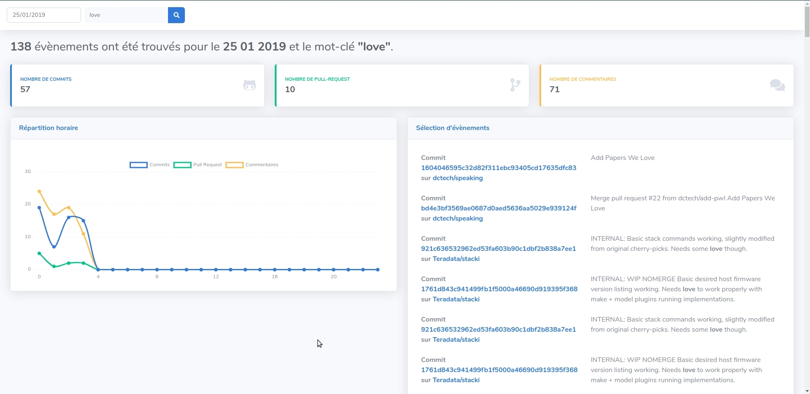

# GitHub archive keyword API

## How to start the project

### Copy the .env file

```bash
cp .env.dist .env
```

**Change the contents**

### Start the docker env

```bash
docker-compose -p gha-keyword up --build
```

### Fill the APP key

**wait to see that the first composer install is done**

```bash
docker-compose -p gha-keyword exec php-7.4-nginx php artisan key:generate
```

### Migrate the database

```bash
docker-compose -p gha-keyword exec php-7.4-nginx php artisan migrate
```

### Ingest data

#### Today

```bash
docker-compose -p gha-keyword exec php-7.4-nginx php artisan ingest --today
```

#### A date

```bash
docker-compose -p gha-keyword exec php-7.4-nginx php artisan ingest --date=2020-01-25
```

### Run the tests

```bash
docker-compose -p gha-keyword exec php-7.4-nginx composer run test
```

### Browse the results

http://localhost:8085/search

### Try the API to get some data

```bash
curl -H 'Accept: application/json' http://localhost:8085/api/search/stats?searchDate=2020-01-25
```

### A screenshot


